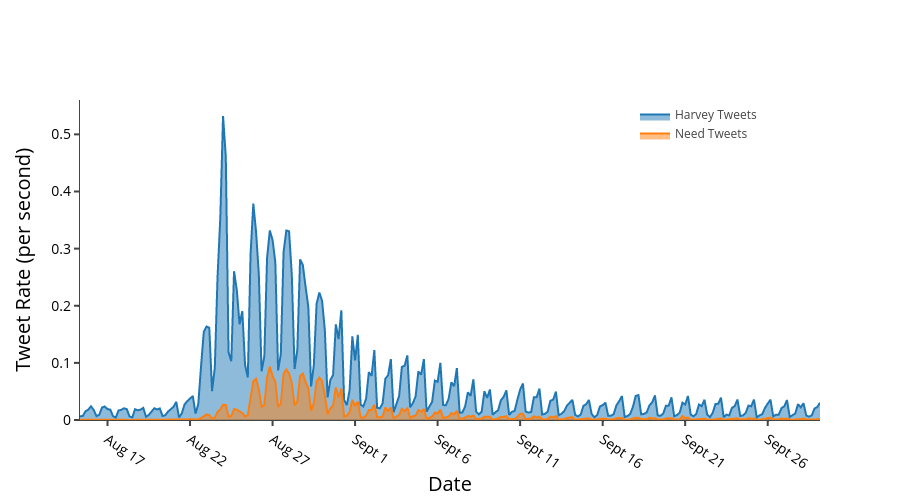

# Tweet Rate Graph 

Creates a graph for tweet rates using Plotly

## Data File Format

[date] [tweet count] [tweet rate]

```
08_20_1 71 0.00493055555555556
08_20_2 50 0.00347222222222222
08_20_3 156 0.0108333333333333
08_20_4 123 0.00854166666666667
08_20_5 176 0.0122222222222222
08_20_6 210 0.0145833333333333
08_21_1 54 0.00375
08_21_2 73 0.00506944444444444
```

## Run Program

`$python tweet-rate.py data.csv`

## Output

This program will create a .png file that contains an area chart graph with y-axis being Tweets per Seconds and x-axis being date.

**Example:**


